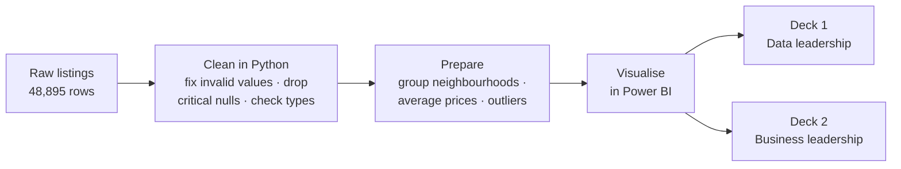
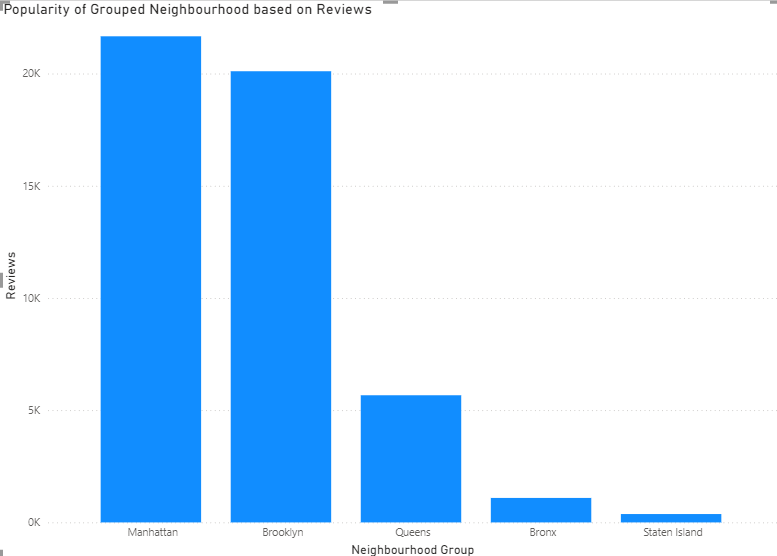
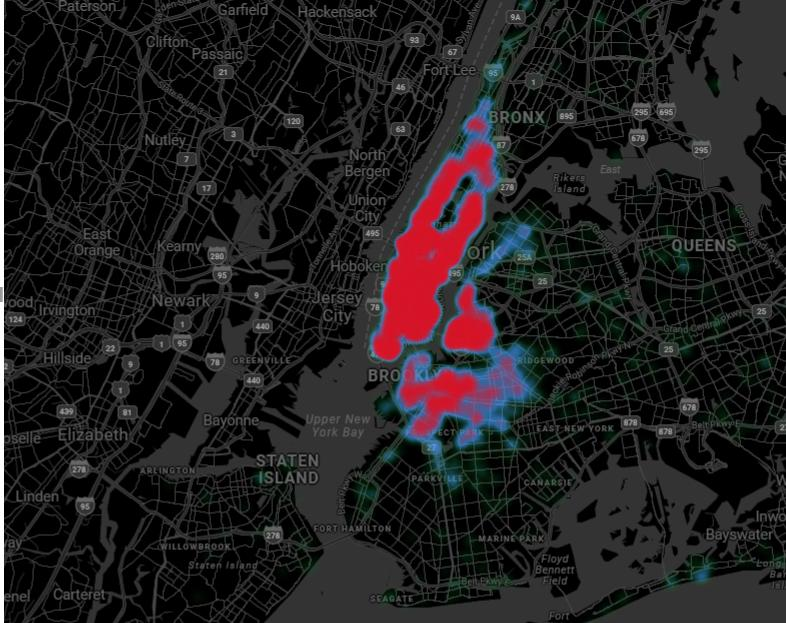
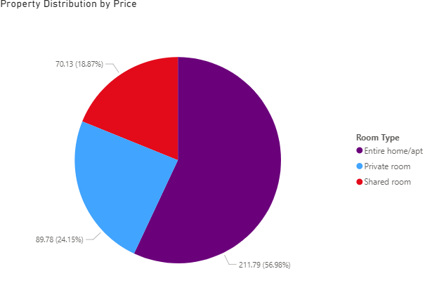
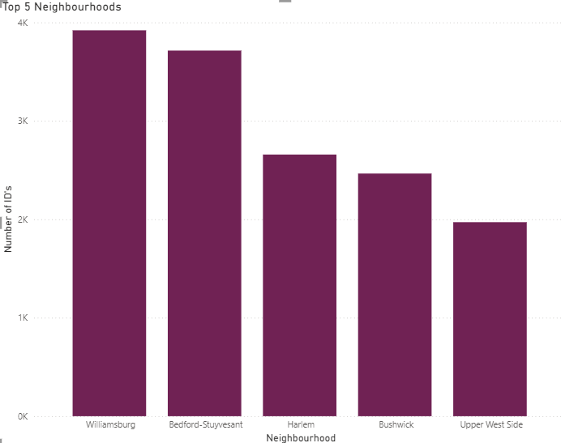
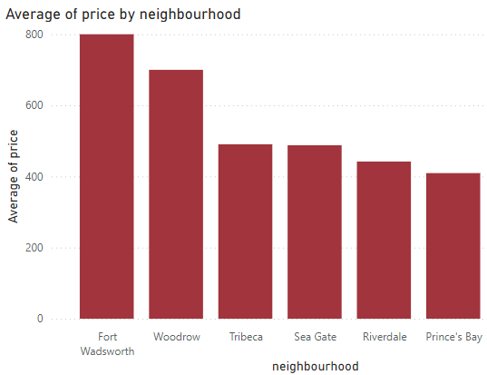
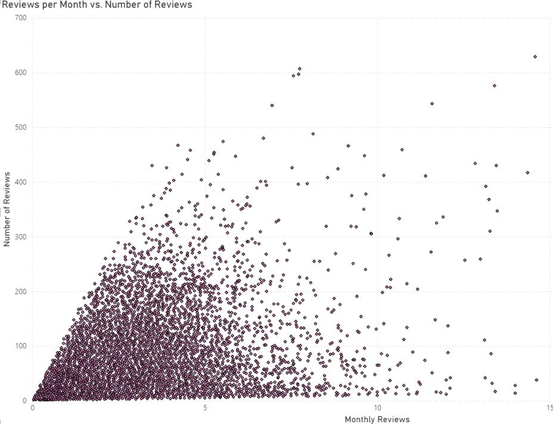

# 🏙️ Airbnb NYC: Data-Driven Listing Insights


An analysis of **~49,000 New York City Airbnb listings (2019)** covering pricing, neighbourhood popularity and review trends, delivered as two presentations for two different audiences: a technical deck for data leadership and a strategy deck for business leadership.

---

## 📌 Business Problem

Airbnb's NYC business saw revenue fall during the pandemic and wants to be ready as travel recovers. Leadership needs to know:

- Which property types and neighbourhoods command the highest prices
- Where listings and guest activity are concentrated
- How review patterns reveal gaps in guest engagement

…so that the **Acquisitions & Operations** team knows which properties to bring on board, and the **User Experience** team knows how to improve the guest journey.

## 🗂️ Data

[`data/AB_NYC_2019.csv`](data/AB_NYC_2019.csv): 48,895 listings × 16 columns.

| Category | Columns |
|---|---|
| Listing | `id`, `name`, `room_type`, `price`, `minimum_nights`, `availability_365` |
| Host | `host_id`, `host_name`, `calculated_host_listings_count` |
| Location | `neighbourhood_group` (borough), `neighbourhood`, `latitude`, `longitude` |
| Reviews | `number_of_reviews`, `last_review`, `reviews_per_month` |

## 🔄 Approach



**Audience-specific storytelling:** the same analysis is told twice.

| Deck | Audience | Focus |
|---|---|---|
| [Analyst presentation](reports/01_analyst_presentation.pdf) | Data Analysis Managers, Lead Data Analyst | What the data shows and how it was prepared |
| [Executive presentation](reports/02_executive_presentation.pdf) | Head of Acquisitions & Operations, Head of User Experience | What to do about it: actionable strategies and expected outcomes |

The full process is documented in the [methodology report](reports/methodology.pdf).

## 📊 Highlights

<table>
<tr>
<td width="50%"><br><sub><b>Manhattan and Brooklyn dominate</b>, together holding 85% of all listings.</sub></td>
<td width="50%"><br><sub><b>Listings cluster in lower/mid Manhattan and north Brooklyn</b>; Queens and Staten Island are far less dense.</sub></td>
</tr>
<tr>
<td width="50%"><br><sub><b>Entire homes earn the most per night</b>: $212 on average vs. $90 for private rooms and $70 for shared rooms.</sub></td>
<td width="50%"><br><sub><b>Williamsburg leads</b> (3,920 listings), followed by Bedford-Stuyvesant and Harlem.</sub></td>
</tr>
<tr>
<td width="50%"><br><sub><b>Premium pockets:</b> Tribeca averages $491/night across 177 listings.</sub></td>
<td width="50%"><br><sub><b>Engagement gaps:</b> some listings have many lifetime reviews but few recent ones.</sub></td>
</tr>
</table>

## 💡 Key Insights

| Area | Finding |
|---|---|
| Property mix | Entire homes/apartments are 52% of listings, private rooms 46%, shared rooms 2%. |
| Pricing | Entire homes average $212/night, more than double private rooms ($90). Manhattan has the highest borough average ($197). |
| Location | Manhattan (21.7K) and Brooklyn (20.1K) hold 85% of listings and attract over 80% of all reviews. |
| Neighbourhoods | Williamsburg, Bedford-Stuyvesant and Harlem have the most listings and hosts. |
| Premium areas | Tribeca, Battery Park City and Flatiron District have the highest average prices among neighbourhoods with a meaningful number of listings. |
| Engagement | Listings with high total reviews but low monthly reviews signal guest engagement that has dropped off over time. |

## ⚠️ Scope & Limitations

- The data is a **2019 snapshot**, so prices and demand predate the pandemic recovery the business problem refers to.
- Average prices for small neighbourhoods (for example, Tribeca at 177 listings) rest on few listings and can be skewed by a handful of very expensive ones, so they should be read alongside listing counts.
- Review counts are a proxy for guest activity, not bookings.

## ✅ Recommendations

1. **Acquire more entire homes in high-demand areas.** They command the highest prices, and demand is concentrated in Manhattan and Brooklyn.
2. **Target premium neighbourhoods** with outreach and onboarding incentives for high-end listings.
3. **Use dynamic pricing** for high-priced listings so they stay competitive in off-peak periods.
4. **Encourage reviews for private rooms** through post-stay incentives and better host–guest interaction.
5. **Promote shared rooms in budget-friendly neighbourhoods** for price-sensitive travellers.
6. **Pilot campaigns in lower-density areas** (parts of Queens and Staten Island) where competition is lower.

## 📁 Repository Structure

```
airbnb-nyc-analysis/
├── README.md
├── data/
│   └── AB_NYC_2019.csv                  # Listings dataset
├── reports/
│   ├── 01_analyst_presentation.pdf      # Deck for data leadership
│   ├── 02_executive_presentation.pdf    # Deck for business leadership
│   ├── methodology.pdf                  # Full methodology report
│   └── methodology.docx                 # Editable version
└── images/                              # Charts used in this README
```

## 🙏 Acknowledgements

Dataset: New York City Airbnb Open Data (2019), originally sourced from [Inside Airbnb](http://insideairbnb.com/). Case study provided as part of a data analytics program.

## 👤 Author

**Mohammed Asad Khan** · [LinkedIn](https://www.linkedin.com/in/mo-asad-kh) · [GitHub](https://github.com/Aasxd)
